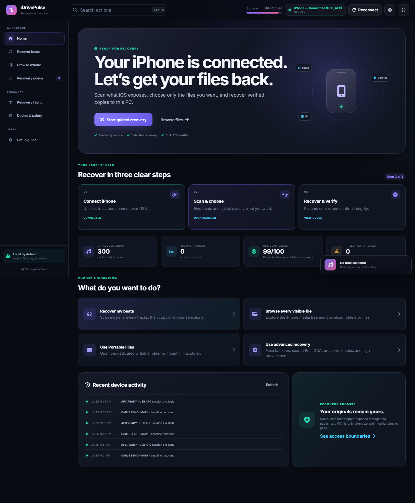
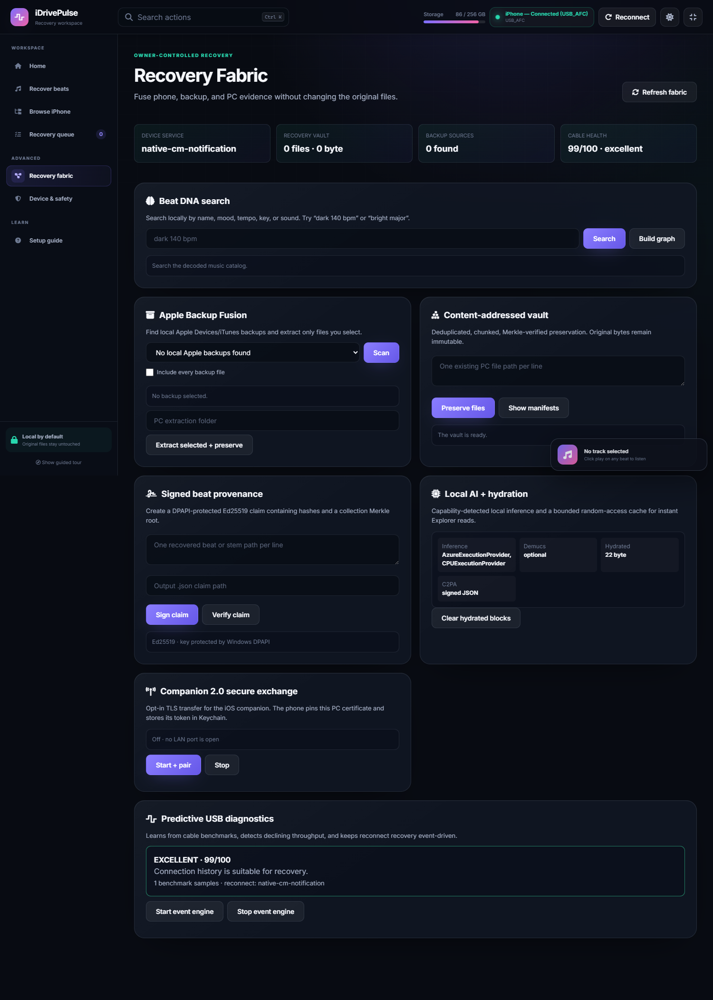
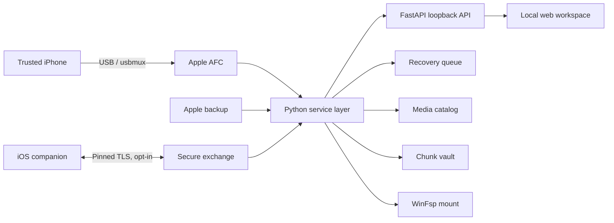

<p align="center">
  
</p>

<h1 align="center">iDrivePulse</h1>

<p align="center">
  <strong>Selective iPhone file recovery and portable storage for Windows.</strong><br>
  Find your original beats, recover only what you choose, verify every copy, and leave the source untouched.
</p>

<p align="center">
  <a href="https://github.com/DocDamage/iphone2pc/actions/workflows/ci.yml"></a>
  
  
  
</p>



## Why this exists

iDrivePulse was built to recover owner-created music and files from an iPhone when no other copy is available. It works with the storage Apple exposes through its trusted USB services, turns hashed music-library filenames back into useful metadata, and copies selected files to a PC using resumable, integrity-checked transfers.

It is also a practical portable-drive workspace: most iPhone storage is presented read-only, while a dedicated **iDrivePulse Portable Files** folder is explicitly writable.

## Highlights

| Area | What it does |
|---|---|
| Selective beat recovery | Scans Apple-exposed storage, previews audio, and queues only selected tracks |
| Decoded music library | Reads `MediaLibrary.sqlitedb` and restores title, artist, album, and playlist context |
| Durable transfer queue | Survives PC restarts, resumes partial copies, retries failures, and preserves order |
| Verified backup mirror | Optionally mirrors recovered files to a second drive and checks SHA-256 |
| Portable drive | Browses visible iPhone storage and mounts it through WinFsp when installed |
| Beat intelligence | Local waveform, BPM, key, loudness, fingerprint, version, and project analysis |
| Recovery Fabric | Fuses Apple backups, Beat DNA relationships, preservation vaults, and provenance |
| Hardware diagnostics | Inspects PnP, Apple services, drivers, registry, kernel state, USB topology, and ETW |
| Companion 2.0 | Adds an iOS File Provider and opt-in certificate-pinned wireless exchange |

## Quick start

### Requirements

- Windows 10 or 11
- Python 3.13
- An unlocked iPhone and data-capable USB cable
- [Apple Devices](https://apps.microsoft.com/detail/9np83lwlpz9k) or Apple's Windows iTunes package for the official USB services

### Install and run

```powershell
git clone https://github.com/DocDamage/iphone2pc.git
cd iphone2pc
python -m pip install -r requirements.txt
python app.py
```

Open [http://127.0.0.1:8765](http://127.0.0.1:8765), unlock the iPhone, tap **Trust This Computer**, and use **Reconnect** if needed.

`start_idrivepulse.bat` is also available after the Python dependencies are installed.

## The recovery workflow

1. **Connect** — use a direct data cable, unlock the phone, and accept Apple's trust prompt.
2. **Scan** — iDrivePulse inventories audio without copying the whole library to a temporary folder.
3. **Choose** — preview, search, filter, and select only the files you want.
4. **Recover** — choose a PC folder and optional backup-drive mirror.
5. **Verify** — final files are published only after byte counts match; SHA-256 is recorded for reports and mirrors.
6. **Back up** — open several recovered files and retain another copy before changing the phone.

Partial transfers use durable `.part` files, bounded AFC reads, a Windows power request, and a SQLite queue. Embedded tags are read only after a PC copy is available. The original iPhone bytes are never retagged or rewritten.

## Workspace map

- **Home** — connection status, three-step guidance, recent activity, cable confidence, and shortcuts.
- **Recover beats** — music scan, decoded metadata, preview, analysis, selection, and export destinations.
- **Browse iPhone** — visible file tree, downloads, Portable Files writes, and Explorer mounting.
- **Recovery queue** — resumable jobs, encrypted rescue vaults, version grouping, projects, and sync.
- **Recovery Fabric** — backup fusion, Beat DNA search, chunk vault, provenance, local AI, and wireless pairing.
- **Device & safety** — access boundaries, Apple services, drivers, registry, kernel, cable, and ETW tools.
- **Setup guide** — first-connection help and keyboard shortcuts.

Press <kbd>Ctrl</kbd> + <kbd>K</kbd> anywhere to search pages and actions.

## Recovery Fabric



### Apple Backup Fusion

Discovers Apple Devices/iTunes backups without modifying them, reads their `Manifest.db`, and extracts only checked files. Audio and DAW/project files are the default focus; scanning every manifest entry is opt-in. Encrypted backups appear as locked and require the owner's password plus a compatible keybag backend—iDrivePulse does not guess or bypass encryption.

### Content-addressed vault

Selected files are split with content-defined chunking, addressed by SHA-256, deduplicated across manifests, and committed with a Merkle root. Deep verification checks each chunk, while reconstruction publishes a destination only after the complete file digest matches.

### Beat DNA

Searches the local catalog by metadata, tempo, key, loudness, and mood-like descriptors. Its relationship graph distinguishes exact copies, acoustic versions, similar-sounding tracks, and project-family variants.

### Signed provenance

Creates an immutable JSON claim for selected beats, stems, and project ingredients. The Ed25519 owner key is protected by Windows DPAPI. Public C2PA trust additionally requires a suitable signing credential and the optional backend.

## Optional capabilities

### Explorer drive letter

Install [WinFsp](https://winfsp.dev/) with its Developer feature, then:

```powershell
winget install --id WinFsp.WinFsp --exact
python -m pip install -r requirements-mount.txt
```

Mounting is read-only except under `/Downloads/iDrivePulse Portable Files`. Always unmount before unplugging the phone.

### Local AI and stem separation

```powershell
python -m pip install -r requirements-ai.txt
```

This enables optional ONNX Runtime DirectML detection and Demucs stem separation. Built-in waveform, tempo, key, loudness, hashing, and fingerprint analysis work without it. Inference remains on the PC.

### C2PA backend

```powershell
python -m pip install -r requirements-provenance.txt
```

The DPAPI/Ed25519 provenance format works with the core dependencies. A trusted X.509 credential is still required for public C2PA trust chains.

### Reconnect Windows service

From an elevated terminal:

```powershell
python device_service.py --startup auto install
python device_service.py start
```

Remove it with `python device_service.py stop` followed by `python device_service.py remove`. The service observes Apple USB arrival/removal; it does not install a custom kernel driver or replace Apple's driver.

## iPhone companion

The [`ios-companion`](ios-companion) folder contains an XcodeGen SwiftUI app and File Provider extension.

1. On a Mac, install Xcode and XcodeGen.
2. Run `xcodegen generate` inside `ios-companion`.
3. Select an Apple development team for both targets.
4. Confirm the `group.com.idrivepulse.companion` App Group capability.
5. Build to the iPhone and open the app once.

USB House Arrest access remains limited to the companion's Documents folder. The Files provider uses a separate app-group exchange location so external editors cannot silently mutate recovery originals.

For wireless transfer, click **Start + pair** in Recovery Fabric and enter the shown HTTPS endpoint, six-digit code, and certificate fingerprint in the companion. Pairing codes are single-use, expire after five minutes, and lock after eight failures. The phone pins the PC certificate, stores its bearer token in Keychain, and verifies downloads with SHA-256. The listener is off by default.

## Architecture



The FastAPI server binds to `127.0.0.1:8765`. Browser fragments and classic JavaScript controllers live under `static/`. Device, catalog, recovery, mount, diagnostics, Fabric, and transfer responsibilities are split into modules kept at or below 300 lines.

## Configuration

| Environment variable | Default | Purpose |
|---|---:|---|
| `IDRIVEPULSE_DATA_DIR` | `./data` | Runtime databases, vaults, diagnostics, and models |
| `IDRIVEPULSE_HYDRATION_QUOTA` | `21474836480` | Explorer hydration-cache quota in bytes |
| `IDRIVEPULSE_WIRELESS_PORT` | `8766` | Opt-in companion TLS port |
| `IDRIVEPULSE_EVENT_URL` | loopback Fabric endpoint | Windows service event destination |

Runtime data, recovered files, keys, traces, caches, and device catalogs are excluded by `.gitignore`.

## Security and privacy

- Core control is loopback-only and cross-site API requests are rejected.
- Recovered content is not uploaded to a cloud service.
- Wireless access is explicit, authenticated, certificate-pinned, and stoppable.
- Paths crossing iPhone/PC boundaries are normalized and constrained.
- Signing keys are DPAPI-protected on Windows.
- Destructive device, service, mount, and trace actions are explicit and guarded.
- Public vulnerability reports should follow [`SECURITY.md`](SECURITY.md).

## Stock iOS boundaries

An iPhone is not exposed as an unrestricted block device. AFC commonly exposes `/var/mobile/Media`, including synced music and DCIM, but not every app-private sandbox, cloud-only object, protected streaming download, or encrypted secret. A trusted PC does not receive iOS root or kernel privileges.

iDrivePulse does **not** jailbreak the phone, exploit iOS, bypass Data Protection, remove DRM, weaken pairing, or promise files Apple does not expose. If a file exists only inside another app, export it to Files or use that app's File Sharing support first.

## Troubleshooting

| Symptom | What to try |
|---|---|
| iPhone not detected | Unlock it, reconnect directly, tap Trust, then verify Apple Devices/iTunes is installed |
| Connection drops | Avoid hubs, keep the phone awake, and run the cable benchmark |
| Music has hashed names | Use **Organize names** to decode the Apple media library before scanning |
| A private app file is missing | Export it from that app to Files or its file-sharing Documents folder |
| Mount button fails | Install WinFsp plus `requirements-mount.txt`, then choose an unused drive letter |
| ETW or service control denied | Run the app or command from an elevated Windows terminal |
| Encrypted backup is locked | Supply the owner's password through a supported keybag backend; bypass is not supported |

## Development and verification

```powershell
python -m pip install -r requirements-dev.txt
python -m compileall -q .
Get-ChildItem static\js\*.js | ForEach-Object { node --check $_.FullName }
python -m pytest -q
```

Browser E2E tests require the local server and Chrome:

```powershell
$env:IDRIVEPULSE_E2E="1"
python -m pytest tests\e2e -q
```

See [`CONTRIBUTING.md`](CONTRIBUTING.md) for code, safety, testing, and UI expectations.

## Project layout

```text
app.py                    FastAPI composition root
app_*_router.py           Focused HTTP/API surfaces
app_*_service.py          Device, media, mount, sync, and worker services
catalog.py                Durable decoded media catalog
recovery_*.py             Queue, reporting, and encrypted rescue vaults
chunk_vault.py            Deduplicated preservation store
backup_fusion.py          Read-only Apple backup discovery and extraction
beat_graph.py             Beat DNA search and relationships
device_events.py          Native Windows PnP notification engine
wireless_exchange.py      Opt-in companion TLS server
iphone_mount*.py          WinFsp virtual filesystem
static/                   Local web interface
ios-companion/            SwiftUI app and File Provider source
tests/                    Unit, integration, and browser tests
```

## Responsible use

Use iDrivePulse only with devices and files you own or are authorized to access. Keep the phone unchanged until important files have been opened and backed up in at least two places.
