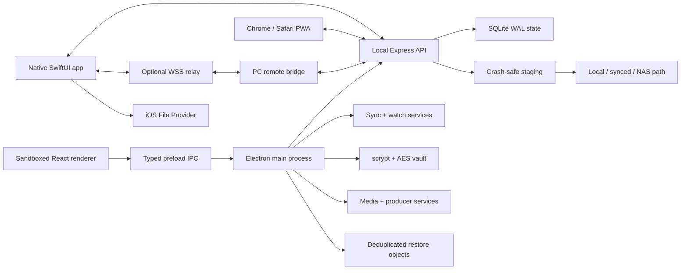

# PocketDock 4.0 Technical Guide

## Architecture



Electron owns filesystem, network, registry, tray, updater, notifications, taskbar, USB, dialog,
and clipboard capabilities. The React renderer is context-isolated and receives only the typed
preload surface.

The local API serves the Chrome/Safari PWA client and protocol. Its locally bundled portable AES-GCM
implementation preserves encrypted transfers when iOS withholds WebCrypto from a plain HTTP LAN
origin. The SwiftUI app uses the same endpoints directly or wraps requests in relay envelopes.
Bonjour advertises
`_pocketdock._tcp`.

## Important source paths

| Path | Purpose |
| --- | --- |
| `electron/main.ts` | Application lifecycle, IPC, tray, updater, firewall, diagnostics |
| `electron/core/transfer-service.ts` | Pairing, permissions, local API, uploads, shares, links |
| `electron/core/store.ts` | SQLite schema, migration, backups, typed JSON records |
| `electron/core/sync-service.ts` | PC manifests, root safety, archive deletion |
| `electron/core/watch-folder-service.ts` | Periodic watched-folder scans |
| `electron/core/vault-service.ts` | scrypt unlock and streaming AES vault |
| `electron/core/media-service.ts` | Thumbnails, WAV parsing, waveform metadata |
| `electron/core/producer-service.ts` | Producer ZIP and SHA manifest |
| `electron/core/artwork-service.ts` | Embedded art, variants, fuzzy scoring, Cover Art Archive |
| `electron/core/productivity-service.ts` | Drive roots, duplicates, recovery, schedule, transport |
| `electron/core/backup-service.ts` | Content-addressed objects, retention, verified restore |
| `electron/core/remote-bridge.ts` | PC WebSocket client and local API proxy |
| `electron/core/remote-replay-guard.ts` | Bounded TTL replay detection for remote requests |
| `src/App.tsx` | Desktop product workflows |
| `src/i18n.ts` | Desktop language resolution/dictionary |
| `public/mobile` | iPhone browser/PWA and private-link clients |
| `ios/PocketDock` | Native app, sync, backup, Keychain, relay/background clients |
| `ios/PocketDockFileProvider` | Native Files provider for the approved PC root |
| `ios/PocketDockShare` | iOS Share Extension queue |
| `ios/PocketDockWidgets` | Live Activity, Dynamic Island, and iOS 18 control |
| `ios/PocketDock/TransferJournal.swift` | Protected durable iOS transfer queue |
| `ios/PocketDock/PhotoMigrationService.swift` | Photo/album/Live Photo migration inventory |
| `ios/PocketDock/MobileVaultService.swift` | Device-only AES-GCM mobile vault |
| `relay` | Docker-ready two-peer WebSocket service |
| `branding/PocketDock_Branding_Pack` | Original production brand assets and manifest |

## Transfer protocol

1. `GET /api/status` returns protocol and limits.
2. `POST /api/pair` exchanges PIN, stable device UUID, name, and platform for session/refresh
   credentials. `POST /api/reconnect` validates the stored refresh-token hash.
3. `POST /api/uploads` validates metadata, permissions, space, conflict/organization policy, and
   a resume fingerprint.
4. `PUT /api/uploads/:id?offset=N` receives an AES-GCM envelope. Headers provide nonce and
   plaintext length. The server requires the measured staged length to equal `N`.
5. `POST /api/uploads/:id/complete` checks full SHA-256, handles content duplicates, and commits.
6. `/api/shares` provides encrypted PC-to-iPhone chunks.
7. `/api/clipboard` uses device-bound AES-GCM AAD and supports pin/expiration/deletion metadata.
8. `/api/diagnostics/mobile`, `/api/studio`, and `/api/drive/search` are authenticated and
   independently permission-gated.

Clients use 4 MB plaintext chunks; the server caps requests at 8 MB.

## Sync protocol

- `/api/sync/profiles` exposes enabled profiles without PC filesystem paths.
- `/api/sync/:id/manifest` returns `{relativePath,size,modifiedAt,sha256}`.
- `/api/sync/:id/file` returns AES-encrypted chunks with profile/path-bound AAD.
- `/api/sync/:id/archive` moves allowed deletions to timestamped archives.
- Sync uploads use the standard upload API with `syncProfileId` and `relativePath`.

PC manifest hashes are cached by size/mtime in `sync_snapshots`. Native iOS keeps its previous
hash snapshot to distinguish local changes, remote changes, deletions, and conflicts.

## Private-link protocol

Public link routes appear before bearer authentication but require
`X-PocketDock-Link-Token`. The stored link contains only a hash. A per-link AES key encrypts file
chunks. The static share page receives token/key through the URL fragment, decrypts with WebCrypto,
checks SHA-256, then reports completion for limit accounting.

## Drive and File Request protocols

`/api/drive` lists only regular files/directories under the approved root. `/api/drive/file`
returns encrypted chunks bound to `drive:<relativePath>`. Mutations require File Provider
permission; relay mutations can be blocked by PC policy. File writes use the normal upload API.

File Request routes precede bearer authentication but require an HMAC-derived token whose hash is
stored in SQLite. File count, size, expiration, and revocation are server-authoritative.
Approval-mode uploads remain in private staging until accepted.

## Artwork discovery

Producer Studio prefers selected artwork, then extracts embedded pictures. It derives bounded
search variants from delivery metadata, tags, and filenames. Damerau-Levenshtein/token scoring
handles misspellings and rejects weak results. Cover Art Archive images are MIME/size/pixel
bounded, rotated, resized without enlargement, and encoded as high-quality JPEG.

## Persistence and recovery

`pocketdock.db` uses WAL and `synchronous=FULL`. The v5 schema covers history, active transfers,
shares, trusted devices, automation, clipboard, sync profiles/snapshots, watch folders, private
links, vault items, producer packages, File Requests, restore manifests, and key/value settings.

Before the 2.5 migration, PocketDock copies the database to `pocketdock.pre-v2.5.db`. Active
uploads have `.part` data and JSON manifests; startup re-measures staged bytes. Vault containers
and completed user files are not stored in SQLite.

Native iOS stages selected outgoing files in Application Support under iOS data protection and
journals transfer metadata. On relaunch, an in-flight job becomes paused, reconnects the trusted
PC, and restarts the normal upload handshake. The server fingerprint locates the staged upload
and returns its measured offset, so recovery does not trust the phone’s last displayed progress.

Offline Drive and Mobile Vault indexes are also protected local files. Vault contents use a
random device-only Keychain master key and per-item AES-GCM nonce. Mobile Vault is deliberately
separate from the PC passphrase vault.

## Remote request transport

The PC and iPhone derive relay room/secret data stored on the PC and embedded in the remote QR.
Both connect as one of two roles:

```text
wss://host/v2/relay?room=<id>&role=<pc|iphone>&secret=<secret>
```

PC and iPhone generate ephemeral X25519 keys and derive a session secret with HKDF-SHA256, salted
by the long-term transfer secret. AES-256-GCM encrypts each complete bounded request envelope.
The relay forwards the opaque tunnel frame. The PC authenticates and decrypts it, allowlists
`/api/` routes and selected headers, adds `X-PocketDock-Remote: 1`, calls the loopback API, and
encrypts the complete response envelope. Request and response directions use distinct AES-GCM
authenticated-data labels, and plaintext application envelopes are rejected.
The PC additionally validates each decrypted request ID with a bounded 10-minute replay window
before forwarding it to the loopback API. Rejections are counted in remote status and diagnostics.

The API still checks the bearer session and per-device remote permission. The relay sees room
membership, timing, and frame sizes, but not API paths, headers, bodies, or status codes.

## Testing

`npm test` covers the local API, storage, cryptography, sync, vault, transfer library, expiring
shares, and the opaque remote tunnel, including:

- Windows filename/path safety;
- PIN sessions and revocation;
- AES-GCM AAD/tamper behavior and SHA implementations;
- SQLite persistence and legacy migration;
- real HTTP resumable encrypted upload and intentional hash failure;
- trusted reconnection, remote permission denial/allow;
- encrypted expiring private-link download;
- complete remote-envelope round-trip, direction binding, tamper, and replay rejection;
- local transfer tag/note normalization, bulk metadata, time-limited shares, and refreshed hashes
  when a previously shared file changes;
- sync filtering, traversal rejection, and archive deletion; and
- vault round-trip, wrong passphrase, and tamper cleanup.
- typo-tolerant artwork matching and unrelated-title rejection;
- File Request limits, staging, approval, and path sanitization; and
- restore-object deduplication and verified restore.

Additional gates:

```text
npm run typecheck
npm run build
npm run verify:ios
npm run verify:hardware
npm run verify:relay
npm run verify:build-tools
```

`verify:build-tools` exercises both the legacy CommonJS and modern module interfaces of the
patched `brace-expansion` compatibility facade, verifies bounded adversarial expansion, and then
runs the complete npm audit. The facade can be removed once Electron Builder ships a stable
dependency tree on the patched upstream API.

`verify:ios` and `verify:hardware` are structural because Linux cannot run Xcode or attach the
required Windows/iPhone/iPad hardware. Final Swift 6 compilation, signing, and every row in
`docs/HARDWARE_TEST_MATRIX.md` must run on physical release devices.

## Packaging

Vite builds renderer assets with relative paths for `file://` loading. esbuild bundles main and
preload dependencies except Electron. Electron Builder creates Windows x64 NSIS/portable output
and includes the mobile client and Windows USB scripts. Network selection ranks physical
Wi-Fi/Ethernet adapters ahead of WSL/Docker/Hyper-V/VPN adapters. USB discovery uses the Windows
Shell portable-device namespace and reports driver, Shell root, storage, and DCIM separately.
PnP is diagnostic evidence of a cable only and cannot enable import. USB is excluded from normal
LAN/relay transport selection. The iOS `UIFileSharingEnabled` path is a distinct manual Documents
staging workflow exposed by Apple Devices.

`scripts/generate-icons.mjs` derives Windows, PWA, and opaque iOS icon output from the supplied
framed brand mark. Publisher certificates and Apple signing material are intentionally absent.
